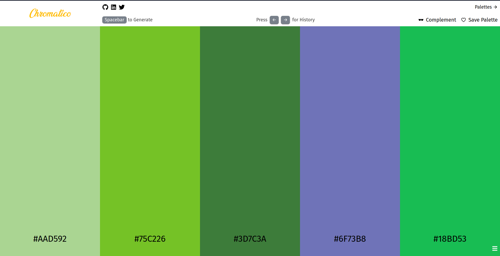

# Chromatico

Chromatico is a powerful and intuitive color generator designed to streamline the color selection process for designers and artists.

- With features like Copy Color, Copy Clipboard, and Save History, Chromatico makes it easy to generate, copy, and save colors quickly and efficiently.

- New Feature: Complement the Palette to get a different palette of color to match with the original one, and a tutorial when you use the website for the first time guiding through all the important features.

- Chromatico is constantly evolving, with new features and improvements being added all the time. Whether you are a professional designer or just someone who enjoys working with colors, Chromatico is the perfect tool to help you work more efficiently and effectively.

- And it can be better by your valuable contribution

## Access the website here - [Chromatico](https://chromatico.vercel.app/)

<br>



<br>

## Tech Stack

This project is built using

- ReactJs with ViteJs and TypeScript
- TailwindCSS
- React Context API
- LocalStorage
- Framer Motion
- React Joyride
- React Icons
- Hosted Using Vercel
- And a bunch of Colors


    


<br>

## Project Setup

1. Fork and clone the project to your local machine.

2. Open the folder and run (It will install all the dependencies)

```bash
    npm install
```

3. To run the application

```bash
    npm run dev
```

<br>

## Folder Structure

To add new components / features

```
|-- src
     |-- components
          |-- <Component>.tsx
```

To add a new Page

```
|-- src
     |-- pages
          |-- <ComponentPage>.tsx
```

To add Global CSS

```
|-- src
     |-- App.css
```

<br>

## Contribution Guide

1. `Fork` and `Clone` the project to your local machine.

2. Follow the steps mentioned in [Project Setup](#project-setup)

3. Create a new branch and do the required changes, follow the folder structure mentioned [here](#folder-structure)

4. Add, Commit and Push

```bash
    git add .
    git commit -m "Commit message"
    git push origin <branch-name>
```

5. Create a Pull Request from your forked repo by pressing the `Compare and Pull Request` button

6. Thats it! You have contributed to the project 🥳

<br>

## License

Chromatico is licensed under the terms of the MIT license. See the [LICENSE File](./LICENSE) for more information.

<br>

## Contributors

<a href="https://github.com/Deveesh-Shetty/Chromatico/graphs/contributors">
  
</a>

<br>

## Connect With Me

[](https://github.com/Deveesh-Shetty)
[](https://www.linkedin.com/in/deveesh-shetty-908539214/)
[](https://twitter.com/shettydeveesh)
[](https://dev.to/deveeshshetty1209)
[](https://hashnode.com/@deveeshshetty)
